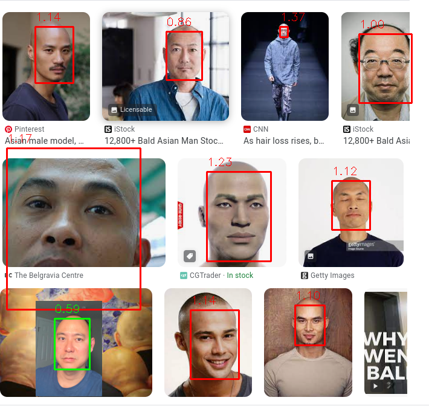
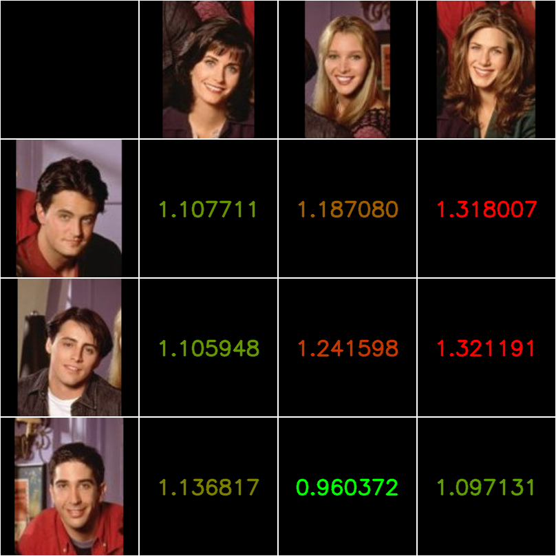

# Face Recognition Visualization

This is a repository related to the following videos:

- Tiktok (https://www.tiktok.com/@codingai/video/7267951758159203615)

## Set up
Install python first. Install the following python packages.
```
pip install facenet-pytorch
pip install opencv-python

```

You may also need to install pytorch
```
pip install torch torchvision
```

The face recognition models should download when you run the script. If not, you can download them from here (https://github.com/timesler/facenet-pytorch).

## Operation

There are 2 modes of operation: finder and matcher.

### Finder



```
python3 finder.py
```

Finder will find, box, and score each person in the target image compared to a reference person. Set up the directories shown below. In the references folder, place multiple images of a single reference person. In the targets folder, place a single image, with multiple people.

```
images/
  finder/
    references/
      image0.png
      image1.png
      .
      .
    targets/
      target_image.png
```
### Matcher



```
python3 matcher.py
```

Matcher will compare rows and columns of people. Set up the directories as shown below. There can be any number of rows/columns. The script will score all rows against all columns.

```
images/
  columns/
    person0/
      image01.png
      image02.png
      .
    person1/
      image11.png
      image12.png
      .
    .
  rows/
    personA/
      imageAA.png
      imageAB.png
      .
    personB/
      imageBA.png
      imageBB.png
      .
    .
```


